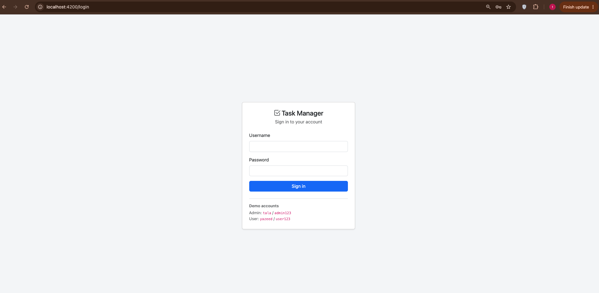
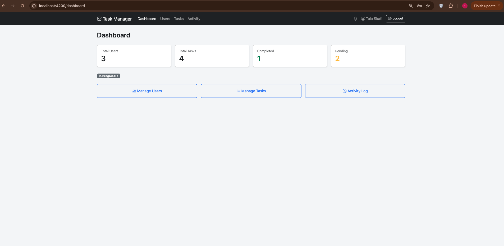
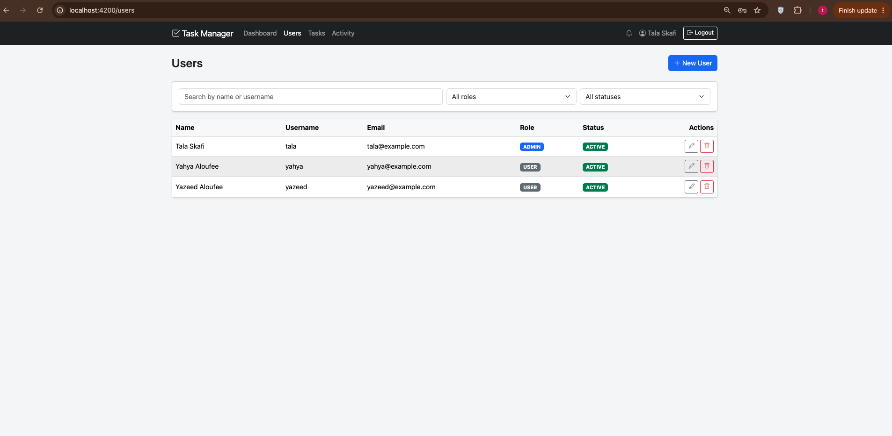
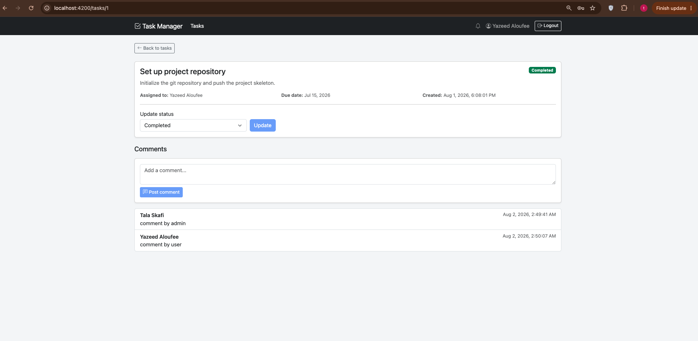
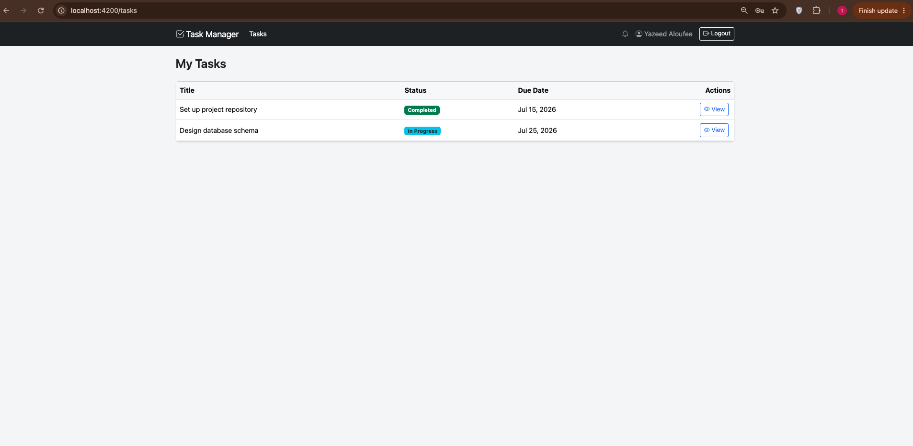
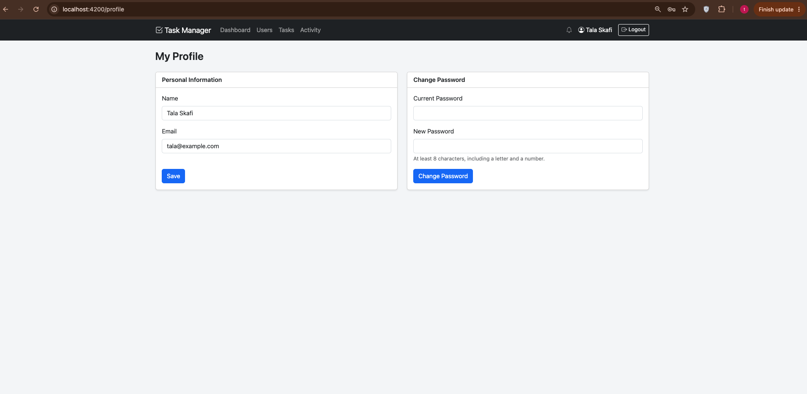

# Task Manager


A small full-stack app for managing people and their work. Admins run the show — they create
users and tasks, hand tasks out, and keep an eye on everything. Regular users log in, see the
tasks assigned to them, move them along, and leave comments. It's built with a Spring Boot API
on the back and an Angular app on the front, styled with Bootstrap.

This was built as an assignment, so the goal was clean, readable code over anything fancy.

## What you can do

**If you're an admin:**
- Add, edit, delete, and search/filter users (by name, role, or status)
- Create tasks, assign them to people, edit them, and delete them
- Comment on any task
- See a dashboard with quick stats (how many users, how many tasks, how many done vs. still open)
- Browse an activity log that records logins, task changes, user changes, and so on
- Get **real-time notifications** about task changes and when other admins add/edit users

**If you're a regular user:**
- See only the tasks assigned to you
- Move a task's status along (Pending → In Progress → Completed)
- Comment on your tasks
- Get **real-time notifications** when a task is assigned to you, its status changes, or someone comments on it

**Everyone** gets a profile page to update their name, email, and password.

## Screenshots

<!-- Drop the PNG files into docs/screenshots/ using the names below and they'll show up here. -->

|  |  |
|:---:|:---:|
| **Login**<br> | **Admin dashboard**<br> |
| **User management**<br> | **Task details & comments**<br> |
| **My tasks (user view)**<br> | **Profile**<br> |

## Built with

- **Backend:** Java 21, Spring Boot 3.4, Spring Security with JWT, Spring Data JPA, Flyway
- **Database:** H2 (in-memory) — more on that below
- **Frontend:** Angular 19, Bootstrap 5
- **Build tools:** Maven (backend), npm/Angular CLI (frontend)

## The database

The app uses **H2 running in-memory**, so there's nothing to install or configure — the database
lives inside the app while it runs. On startup, **Flyway** builds the tables
(`V1__create_schema.sql`) and seeds the starter accounts and sample data (`V2__seed_data.sql`).

Because it's in-memory, **the data resets every time the backend restarts** — handy for demos, just
don't restart halfway through. While the app is running you can inspect the database at
`http://localhost:8080/h2-console` (JDBC URL `jdbc:h2:mem:taskdb`, user `sa`, no password).

## Running it

You'll need **Java 21+**, **Maven 3.9+**, and **Node 18+** installed.

### 1. Start the backend

```bash
cd BE
mvn spring-boot:run
```

It runs on **http://localhost:8080**. First start takes a moment while Maven pulls dependencies.

### 2. Start the frontend

In a second terminal:

```bash
cd frontend
npm install      # first time only
npm start
```

Then open **http://localhost:4200** and you'll land on the login page.

That's it — two terminals, two commands each. The frontend already knows to talk to the backend
on port 8080.

## Logging in

The app comes with three accounts ready to go:

| Name           | Username | Password   | Role  |
|----------------|----------|------------|-------|
| Tala Skafi     | `tala`   | `admin123` | Admin |
| Yazeed Aloufee | `yazeed` | `user123`  | User  |
| Yahya Aloufee  | `yahya`  | `user123`  | User  |

Log in as `tala` to see the admin side, or `yazeed`/`yahya` to see what a regular user sees.

## How security works

Login hands you a **JWT** (a signed token). The Angular app tucks it away and sends it with every
request; the backend checks it on the way in. Nothing is stored server-side, so it's stateless.

Access is split by role:
- User-management and activity-log endpoints are **admin only**
- Task endpoints are open to logged-in users, but a regular user only ever sees and touches
  **their own** tasks — that rule is enforced on the server, not just hidden in the UI

If a token is missing, expired, or you try to reach something you shouldn't, the API answers with
a clear error and the right status code (401 or 403).

## Real-time notifications

The app has a live notification bell in the header (with an unread count). It uses a **WebSocket**
connection, so notifications arrive instantly — no page refresh needed.

You get notified when:
- A task is assigned to you
- The status of one of your tasks changes
- Someone comments on one of your tasks
- An admin adds or edits a user (admins only)

Notifications are **role-aware**: regular users only hear about their own tasks, while admins also
hear about user and task changes. You won't be notified about your own actions. Click a notification
to mark it read, or use "Mark all read" — the read/unread state is saved in the database, so it
sticks after a refresh.

Under the hood the browser connects over STOMP-over-WebSocket at `/ws`, authenticated with the same
JWT, and the server pushes each notification straight to the right user.

## The API at a glance

Everything lives under `/api`:

| Area          | Endpoint                          | Who can use it            |
|---------------|-----------------------------------|---------------------------|
| Auth          | `/api/auth/login`, `/logout`      | Everyone                  |
| Profile       | `/api/profile`                    | Any logged-in user        |
| Users         | `/api/users`                      | Admin only                |
| Tasks         | `/api/tasks`                      | Admin (all) / User (own)  |
| Comments      | `/api/tasks/{id}/comments`        | Admin or the assignee     |
| Notifications | `/api/notifications`              | Your own notifications    |
| Stats         | `/api/stats`                      | Admin only                |
| Activity log  | `/api/activity-logs`              | Admin only                |

Real-time notifications are pushed over a WebSocket at `/ws` (not a REST endpoint).

## Project layout

```
Assignment/
├── BE/          Spring Boot API (organized by feature: user, task, comment, activity, notification, ...)
└── frontend/    Angular app (core services/guards, shared layout, feature screens)
```

## What's built

Everything in the assignment is done and working — users, tasks, comments, profiles, stats,
activity log, role-based access, JWT, and the advanced **real-time notifications over WebSockets**.
